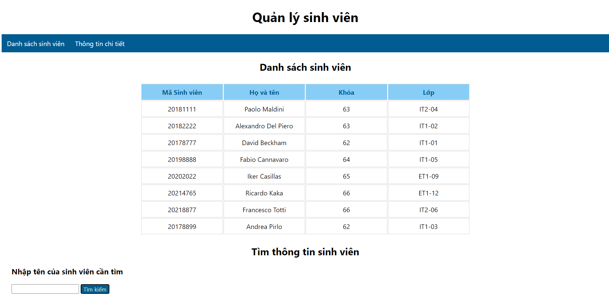
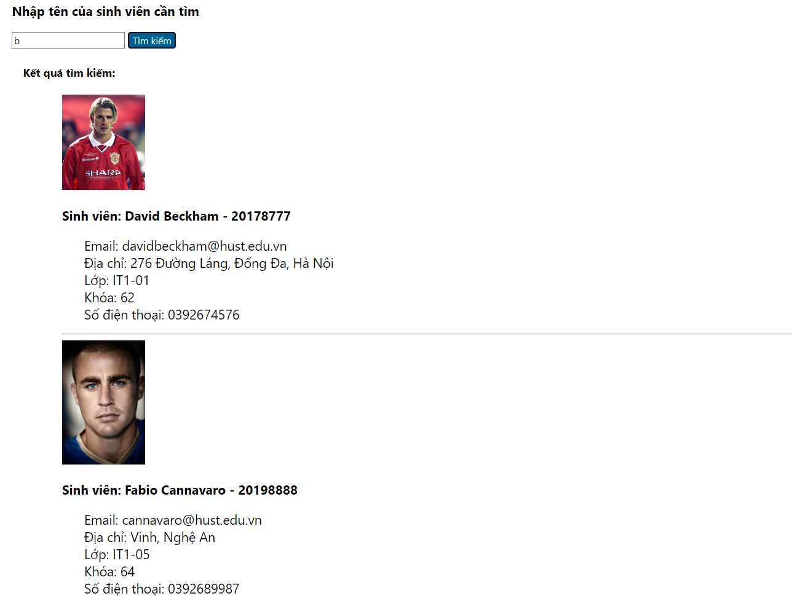
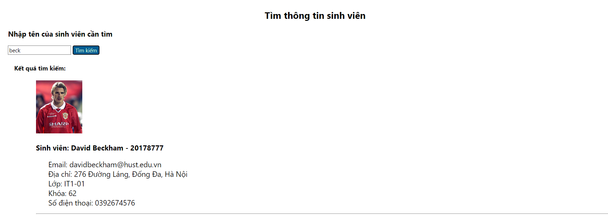
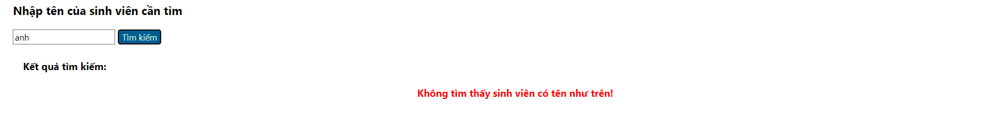

## Tạo trang web với HTML/CSS (kết hợp JS cho chức năng tìm kiếm)
### Giao diện danh sách sinh viên:

### Giao diện tìm kiếm thông tin chi tiết mỗi sinh viên theo tên:

### Khi không có kết quả nào phù hợp:
